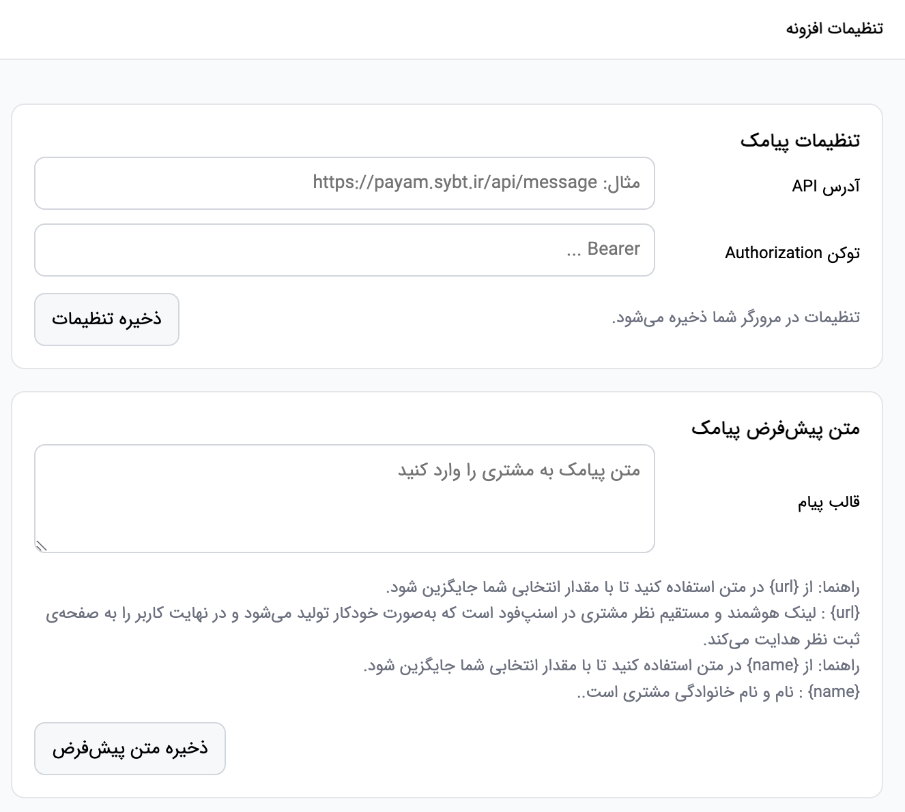
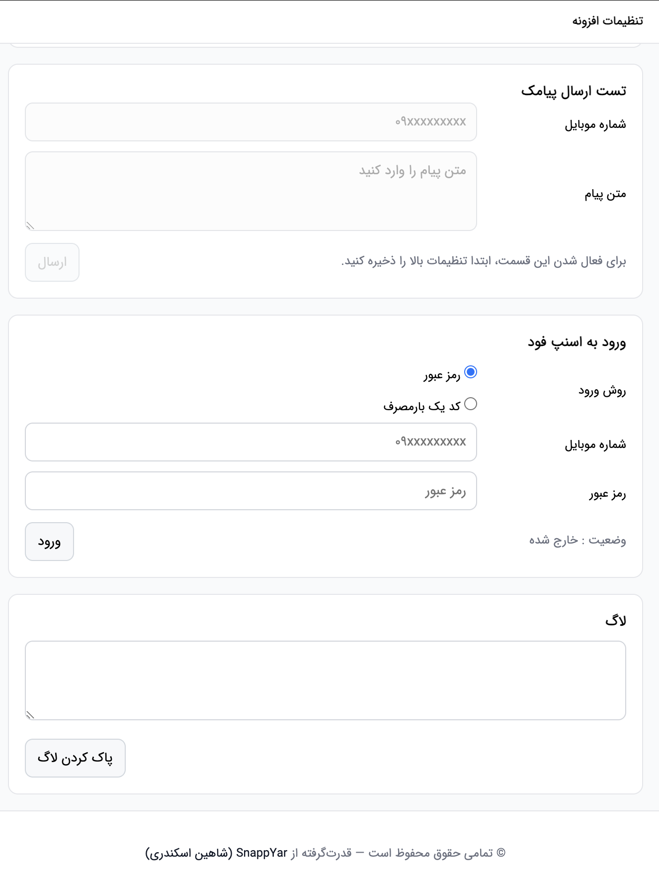
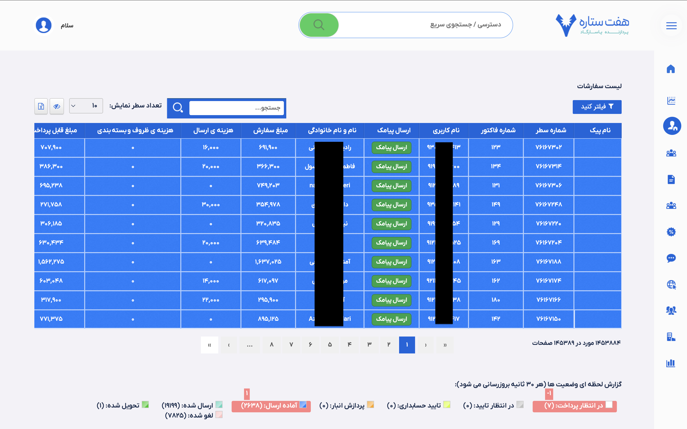
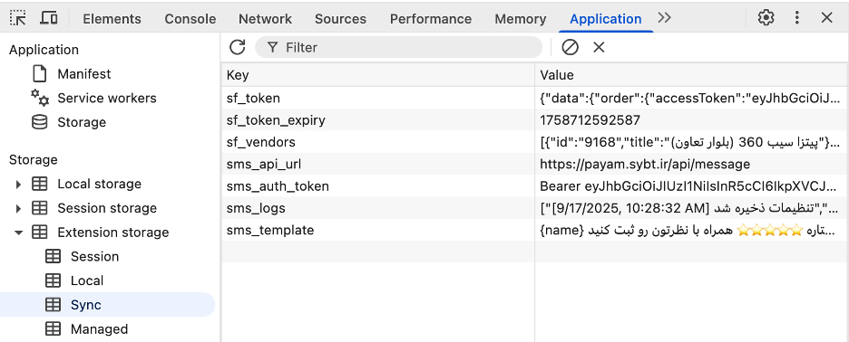
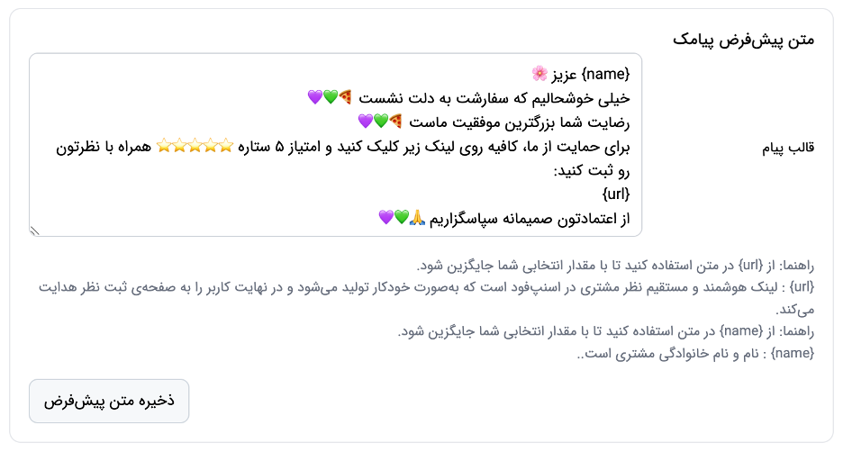
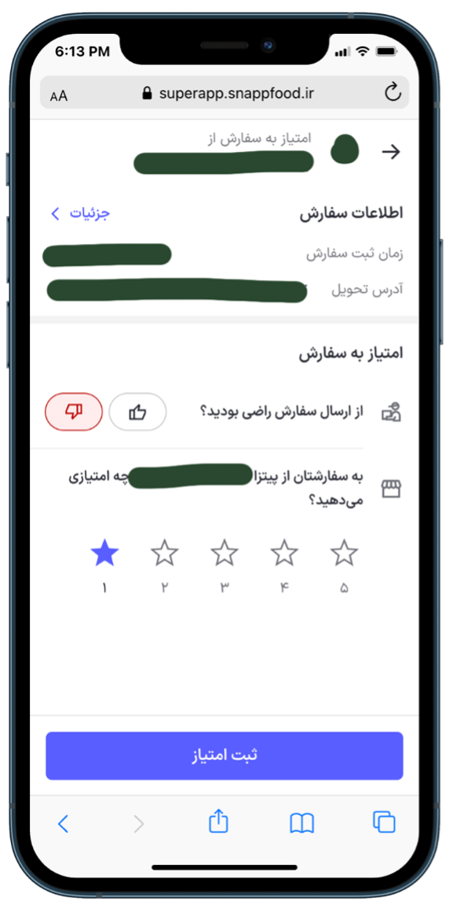

# SnappEasyRate 🚀

- **English:** 
SnappEasyRate is a **custom add-on designed exclusively for Sib360 and Mizban** to boost customer engagement and satisfaction in the SnappFood ecosystem.  
This tool simplifies the process of collecting customer feedback and ratings by enabling operators to send direct review links via SMS with just one click.  

- **فارسی:**  
افزونه **SnappEasyRate** یک ابزار اختصاصی است که به‌طور ویژه برای **سیب ۳۶۰** طراحی شده تا تعامل و رضایت مشتریان را در اکوسیستم اسنپ‌فود افزایش دهد.  
این ابزار فرآیند جمع‌آوری بازخورد و امتیاز مشتریان را ساده می‌کند و به اپراتورها امکان می‌دهد تنها با یک کلیک، لینک مستقیم ثبت نظر را از طریق پیامک برای مشتری ارسال کنند.  

---

## ✨ Key Features | ویژگی‌های کلیدی  

- **English:**
    - 📲 **One-Click SMS Sending**  
    Operators can send a predefined message with a direct review link to customers with just one click.

    - 🔄 **Integrated with Mizban 365**  
    Feedback data is stored directly in Mizban 365 tables, ready for BI analysis and management dashboards.

    - 👍 **Increased Customer Participation**  
    Simplifying the feedback process encourages more customers to submit reviews.

    - ⭐ **Improved Branch Rating and Ranking**  
    Satisfied customers are encouraged to leave positive reviews, boosting the branch’s SnappFood ranking.

    - ⚡ **Fast and Seamless User Experience**  
    Operator-focused interface minimizes the time required to use the system.

    - 🔒 **Customizable SMS Messages**  
    Ready-to-use SMS templates can be adapted to the brand’s tone or branch-specific needs.

    - 📊 **Analytics and Reporting Capabilities**  
    All customer feedback data can be connected to analytical dashboards and management reports.

    - 🛠 **Easy Installation and Configuration**  
    Can be activated directly on the Sib360 platform without complex changes.

    - 🌐 **Multilingual Support**  
    Messages can be localized and sent in different languages according to customer preferences.

    - 🔔 **Notification Management**  
    Operators can receive internal notifications for faster review of customer feedback.

    - 📥 **Secure Data Storage**  
    All feedback information is securely stored and fully traceable in the system.

- **فارسی:**  
    - 🔄 **یکپارچه با میزبان ۳۶۵**  
    داده‌های نظرات مستقیماً در جدول‌های میزبان ۳۶۵ ذخیره می‌شود تا برای تحلیل BI و داشبوردهای مدیریتی آماده باشد.

    - 👍 **افزایش نرخ مشارکت مشتریان**  
    ساده‌سازی فرآیند بازخورد باعث می‌شود مشتریان بیشتری وارد فرآیند ثبت نظر شوند.

    - ⭐ **بهبود امتیاز و رتبه شعبه**  
    مشتریان راضی تشویق می‌شوند نظر مثبت ثبت کنند و این موضوع رتبه شعبه در SnappFood را ارتقا می‌دهد.

    - ⚡ **تجربه کاربری سریع و بدون وقفه**  
    رابط کاربری کاملاً اپراتور-محور طراحی شده و استفاده از آن زمان اپراتور را به حداقل می‌رساند.

    - 🔒 **پیامک‌های قابل شخصی‌سازی**  
    قالب‌های آماده پیامک را می‌توان با لحن برند یا نیاز هر شعبه تغییر داد.

    - 📊 **قابلیت تحلیل و گزارش‌گیری**  
    تمام داده‌های بازخورد مشتریان قابل اتصال به داشبوردهای تحلیلی و گزارش‌های مدیریتی است.

    - 🛠 **نصب و پیکربندی آسان**  
    بدون نیاز به تغییرات پیچیده، مستقیماً در بستر Sib360 فعال می‌شود.

    - 🌐 **پشتیبانی چندزبانه**  
    امکان بومی‌سازی و ارسال پیام‌ها به زبان‌های مختلف متناسب با مشتریان.

    - 🔔 **مدیریت اعلان‌ها**  
    اپراتورها می‌توانند اعلان‌های داخلی برای بررسی سریع‌تر نظرات مشتریان دریافت کنند.

    - 📥 **ذخیره‌سازی ایمن داده‌ها**  
    کلیه اطلاعات بازخورد به شکل امن و قابل ردیابی در سیستم ثبت می‌شود.

---

## 🛠 How It Works | نحوه عملکرد

- **English:**
    1. Operator contacts the customer to ensure satisfaction.
    2. If the customer is happy, the operator requests a quick review.
    3. Instead of explaining complex steps, the operator simply clicks the **"Send SMS"** button inside the Sib360 order list.
    4. The customer receives a **direct link** to the review page, making it effortless to leave feedback.
    5. This streamlined approach increases engagement and strengthens customer trust.

- **فارسی:**
    1. اپراتور با مشتری تماس می‌گیرد تا از رضایت او اطمینان حاصل کند.
    2. در صورت رضایت مشتری، اپراتور درخواست ثبت یک نظر سریع می‌کند.
    3. به جای توضیح مراحل پیچیده، اپراتور تنها با کلیک روی دکمه **"ارسال پیامک"** در لیست سفارش‌های Sib360 اقدام می‌کند.
    4. مشتری یک **لینک مستقیم** به صفحه نظرخواهی دریافت می‌کند که ثبت بازخورد را بسیار ساده می‌کند.
    5. این روش ساده‌شده، نرخ مشارکت را افزایش داده و اعتماد مشتری را تقویت می‌کند.

---

## 📌 Use Cases | موارد استفاده

- **English:**
    - Designed **exclusively for Sib360** branches using SnappFood.
    - Suitable for customer service teams aiming to:
        - Improve overall ratings.
        - Increase brand trust and customer loyalty.
        - Gather more authentic customer insights.
    - Ideal for branches where **manual guidance takes time** and reduces participation.

- **فارسی:**
    - طراحی شده **به‌طور اختصاصی برای شعب Sib360** که از SnappFood استفاده می‌کنند.
    - مناسب برای تیم‌های خدمات مشتری که هدفشان است:
        - بهبود امتیاز کلی شعبه.
        - افزایش اعتماد به برند و وفاداری مشتریان.
        - جمع‌آوری بازخوردهای واقعی و معتبر از مشتریان.
    - ایده‌آل برای شعبی که **راهنمایی دستی زمان‌بر است** و باعث کاهش مشارکت می‌شود.
---

## 🚀 Benefits | مزایا

- **English:**
    - More reviews in less time.
    - Higher average ratings for branches.
    - Increased visibility and credibility within SnappFood.
    - Stronger customer relationships through simplified interactions.

- **فارسی:**
    - ثبت نظرات بیشتر در زمان کمتر.
    - افزایش امتیاز متوسط شعبه‌ها.
    - ارتقای دید و اعتبار شعبه در SnappFood.
    - تقویت روابط با مشتریان از طریق تعاملات ساده‌شده.

---

## 📷 Screenshots

** نمونه هدایت مستقیم لینک هوشمند به صفحه ثبت امتیاز **

---

## 📄 License | مجوز

- **English:**  
This project is proprietary but can be **customized, extended, or used for your own website**.  
Unauthorized redistribution or resale is not allowed.

- **فارسی:**  
این پروژه خصوصی است اما می‌توان آن را **شخصی‌سازی، توسعه داد یا برای وب‌سایت خود استفاده کرد**.  
توزیع یا فروش بدون مجوز مجاز نیست.

---

## 👨‍💻 Author | نویسنده

- **English:**  
Developed by **Shahin Eskandari**, an experienced **BI Developer, Solution Provider, and Automation Engineer**.  
Specialized in designing **integrated BI dashboards, data pipelines, and workflow automation systems** for employees and businesses.  
For inquiries, collaborations, or custom integrations, please contact:

- **فارسی:**  
توسعه داده شده توسط **شاهین اسکندری**، متخصص **هوش تجاری (BI)، ارائه‌دهنده راهکارهای سازمانی و مهندس اتوماسیون**.  
متخصص در طراحی **داشبوردهای یکپارچه BI، خطوط داده (Data Pipelines) و سیستم‌های اتوماسیون فرآیندها** برای کارکنان و کسب‌وکارها.  
برای پرسش‌ها، همکاری‌ها یا یکپارچه‌سازی‌های سفارشی، لطفاً تماس بگیرید:

📧 [imshahineskandari@gmail.com] (mailto:imshahineskandari@gmail.com)
🌐 [linkedin.com/in/shahin-eskandari](https://www.linkedin.com/in/shahin-eskandari/)
